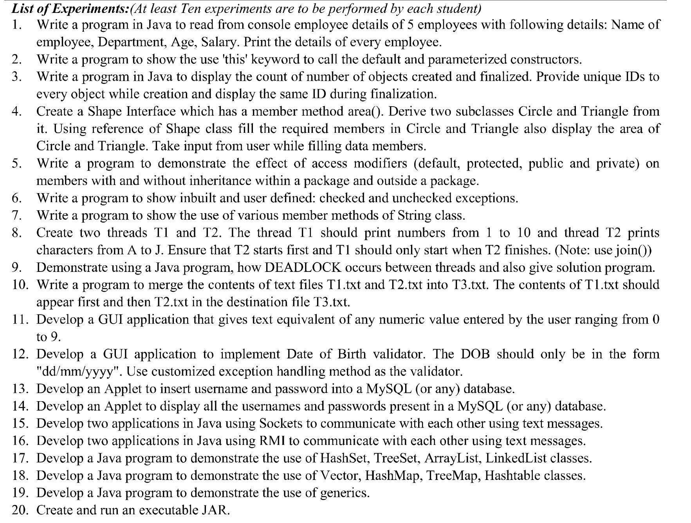

# JAVA LAB

- exp1 - `employee1.java`: read from console employee details of 5 employees: name, dept, age, salary, and print.

- exp2 - `thiscalls.java`: use this keyword to call default and parametrized constructor.

- exp3 - `countObjs.java`: count no. of objects created and initialized with unique ID for each.

- exp4 - `shapeInterface.java`: shape interface with area() method and circle, triangle class implements of shape with user input.

- exp5 - `access-modifiers/`: demonstrate effects of default, private, protected, public in packages and outside packages. RUN `javac Test.java` should compile the class and subclass in the package `packagename`.

