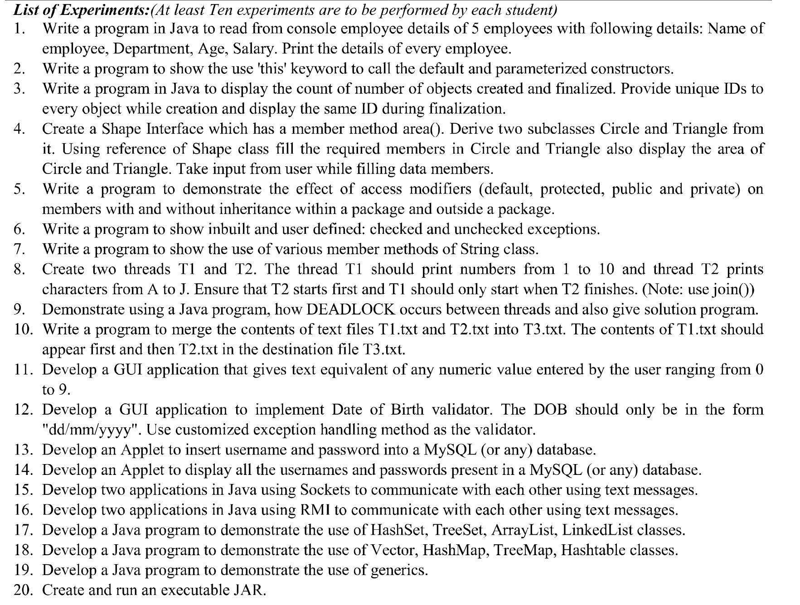

# Java

## LAB

- exp1 - `employee1.java`: read from console employee details of 5 employees: name, dept, age, salary, and print.

- exp2 - `thiscalls.java`: use this keyword to call default and parametrized constructor.

- exp3 - `countObjs.java`: count no. of objects created and initialized with unique ID for each.
